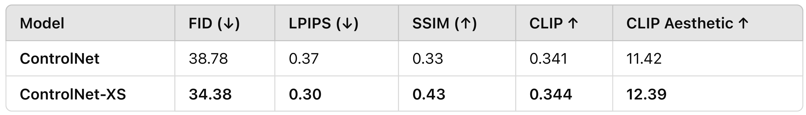
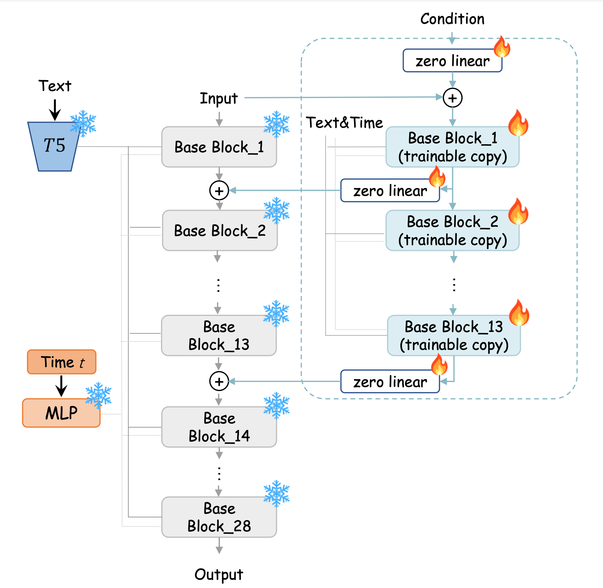

# ControlNet Training

This repository contains code for training and fine-tuning a ControlNet model in a modular, maintainable, and professional manner.

## Repository Structure

```
controlnet_training/
├── config/
│   └── config.py          # Hyperparameters and configuration settings
├── data/
│   └── dataset.py         # Dataset and DataModule classes for handling HDF5 data
├── models/
│   └── finetuner.py       # Model definition (ControlNetFineTuner, ControlNet-XS block, etc.)
├── scripts/
│   ├── encode_images.py   # Script to encode images and edges into an HDF5 file
│   └── encode_texts.py    # Script to encode text prompts into an HDF5 file
├── utils/
│   ├── helpers.py         # Utility functions (seeding, loss weighting, etc.)
│   └── logging.py         # (Optional) WandB logging setup
├── assets/                # Images, figures, and other media for documentation
├── train.py               # Main training script
├── inference.py           # Script for generating images after training
├── evaluate.py            # Script for computing evaluation metrics
├── requirements.txt       # Python dependencies
└── README.md              # Project instructions
```

## Setup

1. **Clone the Repository:**

   ```bash
   git clone https://github.com/yourusername/controlnet_training.git
   cd controlnet_training
   ```

2. **Install Dependencies:**

   ```bash
   pip install -r requirements.txt
   ```

3. **Prepare Data:**

   - Run the image encoding script:
     ```bash
     python scripts/encode_images.py
     ```
   - Run the text encoding script:
     ```bash
     python scripts/encode_texts.py
     ```

## Training

To train the model, run:

```bash
python train.py
```

## Inference

To generate images with the trained model, run:

```bash
python inference.py
```

## Evaluation

To compute evaluation metrics, run:

```bash
python evaluate.py
```

## ControlNet-XS Block

One of the highlights of this project is the elegant and modular design of the ControlNet-XS block. Below is an implementation of the ControlNet-XS block, which demonstrates a key design choice:  
- **Feedback-Control System:** The block uses a "zero linear" layer not only on the first block, but on subsequent ones as well. This design helps in implementing a feedback-control mechanism by modulating the input with learnable residuals.
- **Ease of Integration:** The block is designed to be easily inserted into any transformer module, making it versatile for various tasks.

```python
class ControlNetBlock(nn.Module):
    def __init__(self, target_block, channels, first_block=False):
        super().__init__()
        self.og_block = target_block
        self.first_block = first_block
        self.trainable_block = copy.deepcopy(target_block)
        for param in self.trainable_block.parameters():
            param.requires_grad = True
        self.zero_linear1 = nn.Linear(channels, channels).to(next(target_block.parameters()).device)
        nn.init.zeros_(self.zero_linear1.weight)
        nn.init.zeros_(self.zero_linear1.bias)
        self.zero_linear2 = nn.Linear(channels, channels).to(next(target_block.parameters()).device)
        nn.init.zeros_(self.zero_linear2.weight)
        nn.init.zeros_(self.zero_linear2.bias)

    def forward(self, x, c, *args, **kwargs):
        c = self.zero_linear1(c)  
        c = x + c
        c_next = self.trainable_block(c, *args, **kwargs)
        c = self.zero_linear2(c_next)
        x = self.og_block(x, *args, **kwargs)
        return x + c, c_next
```

## Assets

All images and figures for documentation are stored in the `assets` folder.

<p>
  
  
  
</p>
